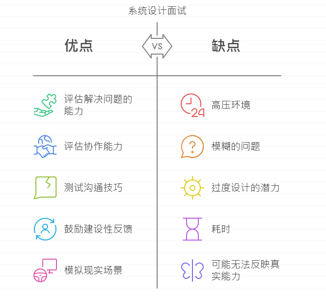

# 系統設計面試：破解結構思維與高效表達

Created: March 25, 2025 9:40 PM
Updated: April 10, 2025 6:32 PM

# 📘 系統設計面試：破解結構思維與高效表達

---

- 🧠 為什麼系統設計面試這麼難？
    - 問題模糊、開放，像是「設計產品X」
    - 沒有正解，重點是展現**解決問題的思維過程**
    - 面試官觀察重點：
        - 技術邏輯 vs. 合作表達
        - 問題分析 vs. 假設能力
        - 架構視角 vs. 細節掌握
    
    
    

---

- 🧭 系統設計面試的4大步驟
    
    
    

---

- 📍 第一步：釐清需求（5 分鐘）
    
    > 🛑 別當吉米！別急著回答，先問對問題。
    > 
    
    ### 🔎 詢問關鍵問題：
    
    - 是 Web 還是 Mobile 應用？
    - 每日活躍使用者數量？增長速度？
    - 功能是 MVP 還是完整產品？
    - 有無現成服務可利用？（如 CDN、雲儲存）

---

- 🧱 第二步：提出高層設計（10 分鐘）
    
    ### 架構藍圖範例：新聞動態系統
    
    
    
    
    
    - 發文流程（Post）
    - 動態取得（Feed）
    - 架構是否支援水平擴展？

---

- 🔍 第三步：深入設計（15 分鐘）
    
    
    
    ### 可討論重點：
    
    - 數據一致性處理
    - 高併發寫入（如貼文）怎麼設計？
    - 資料庫 Schema 示意
    
    ### 快取策略（Cache）
    
    - 熱門 Feed 是否提前預載？
    - Redis Key Design？TTL？
    
    
    
    
    

---

- 🧾 第四步：總結與延伸（5 分鐘）
    
    ### 回顧總體設計
    
    - 架構模組串接是否合理？
    - 邏輯是否對應實際場景？
    
    ### 延伸討論
    
    - 如何從 100 萬用戶擴充到 1000 萬？
    - 當某個模組壞掉（DB、MQ）時怎麼處理？
    - 如何做異常監控與告警？

---

- ✅ 面試中的 Do & Don’t
    
    ### ✅ 該做：
    
    - 勇於提問與確認假設
    - 願意修正與調整設計
    - 強調設計「取捨」與彈性
    - 多與面試官互動合作
    
    ### ❌ 不該做：
    
    - 不釐清需求就直接設計
    - 過度複雜或鑽牛角尖
    - 忽略溝通與圖解
    - 忘記考慮擴展性與故障處理

---

- ⏰ 時間分配建議（總長 40 分鐘）
    
    
    | 步驟 | 所需時間 | 備註 |
    | --- | --- | --- |
    | 第1步：釐清需求 | 5 分鐘 | 精準提問，收斂方向 |
    | 第2步：高層設計 | 10 分鐘 | 畫出系統全貌，取得共識 |
    | 第3步：深入設計 | 15 分鐘 | 探討瓶頸與模組策略 |
    | 第4步：總結 | 5 分鐘 | 提出可擴展性與改善方案 |
    | QA / 緩衝 | 5 分鐘 | 回答面試官追問 |